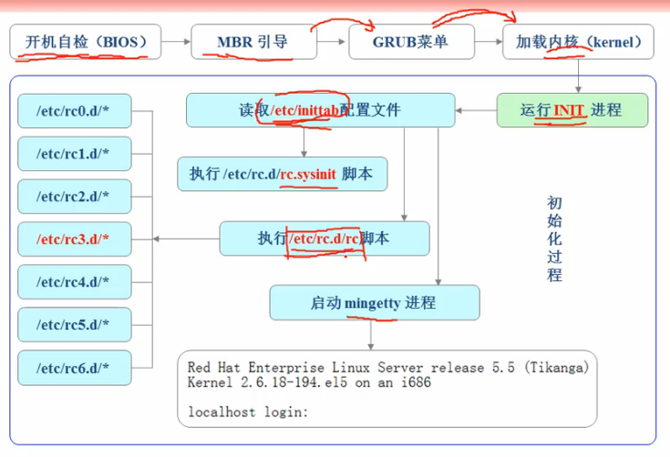

## 总体流程

1. BIOS
  1. POST自检，检查硬件设备
  2. BIOS (Boot Sequence)
2. 引导操作系统
  1. 加载对应引导上的MBR
  2. 主引导设备加载其Bootloader
3. 加载操作系统

符一张图片，图片来自网络


## POST自检

电脑主机打开电源的时候，随后会听到滴的一声，系统启动开始了开机自检（power on self test），这个过程中主要是检测计算机硬件设备比如：CPU、内存、主板、显卡、CMOS等设备是否有故障存在

如果有硬件故障的话：
 - 严重故障（致命性故障）则停机，此时由于各种初始化操作还没完成，不能给出任何提示或信号；
 - 非严重故障，给出提示或声音报警信号，等待用户处理

## BIOS

BIOS（Basic input ouput system）作为开机程序被刷入ROM芯片，计算机通电后首先读取它。

### 硬件自检 POST

电脑主机打开电源的时候，随后会听到滴的一声，系统启动开始了开机自检（power on self test），这个过程中主要是检测计算机硬件设备比如：CPU、内存、主板、显卡、CMOS等设备是否有故障存在

如果有硬件故障的话，主板会发出不同含义的蜂鸣，启动终止。

### 启动顺序 Boot sequence

硬件自检完成后，BIOS根据“启动顺序”里的设置，逐个检查启动程序位置。启动设备主要包括硬盘、USB、SD等，一般用硬盘，一下为查找硬盘的启动程序

#### 主引导记录 MBR

读取硬盘的第一个扇区，也就是最前面的512字节。如果这512字节的最后两个字节为魔法数0x55, 0xAA，则表明这个设备可以用于启动；否则BIOS检查“启动顺序”中的下一个设备

##### MBR的结构

主引导记录的主要作用是，告诉计算机到硬盘的哪一个位置去找操作系统。

```
（1）第1-446字节：调用操作系统的机器码，就是Boot Loader，而具体到你的电脑，那就是lilo或者grub了
（2）第447-510字节：分区表（Partition table）
（3）第511-512字节：主引导记录签名（0x55和0xAA）
```

##### 分区表

分区表的长度只有64个字节，里面又分成四项，每项16个字节。所以一个硬盘最多只能分4个一级分区，又叫主分区。

每个主分区的16个字节，由6部分组成：

```
（1）第1字节：    如果为0x80，就表示激活分区，控制权就转交给该分区。四个主分区只能有一个是激活的
（2）第2-4字节：  第一个扇区的物理位置（柱面、磁头、扇区号等）
（3）第5字节：    主分区类型
（4）第6-8字节：  最后一个扇区的物理位置
（5）第9-12字节： 第一个扇区的逻辑地址
（6）第13-16字节：扇区总数，四个字节，32位，所以一个分区最多有2^32个扇区
```

## 启动管理器 Boot loader

运行事先安装的“启动管理器”，大多为Grub，由用户选择启动哪一个操作系统

## 加载内核

跟据Grub设定的内存映射路径，系统读取内存映像，并进行解压缩操作。此时屏幕一般会输出”Uncompressing linux”的提示，解压完成后，输出“OK, booting the kernel”。

## 启动初始化进程init

内核文件加载之后，就开始运行第一个程序/sbin/init，它的作用是初始化系统环境

由于init是第一个运行的程序，它的进程编号pid就是1，其他所有进程都是从他衍生的，都是它的子进程

### 启动守护进程

许多程序需要开机启动，他们在windows叫做“服务”（service），在Linux叫做“守护进程”（daemon）

init的一大任务就是去运行这些开机启动的程序。但是不同场合需要启动不同的程序，Linux使用“运行级别”为不同场合配置不同的开机启动程序，但是又有不同的实现方法，早起的System V initialization、Ubuntu的Upstart、较流行的systemd

Linux预置七种运行级别（0-6），可在/etc/init/rc-sysinit.conf中查看，可以看到类似的（Ubuntu下）：env DEFAULT_RUNLEVEL=2

表明系统启动时的默认运行级别是2，如果需要指定其他级别，可以手动修改这个值。

之后系统执行/etc/rc2.d目录指定的启动程序。rc标示run command，最后的d表示directory，例如本机的内容如下：

```
$:~/Programs/linux-source-4.4.0$ ls /etc/rc2.d/
README             S02anacron     S02speech-dispatcher  S04saned
S01apport          S02cgproxy     S02thermald           S05grub-common
S01binfmt-support  S02cron        S02whoopsie           S05ondemand
S01cgmanager       S02dbus        S03avahi-daemon       S05plymouth
S01dns-clean       S02irqbalance  S03bluetooth          S05rc.local
S01rsyslog         S02kerneloops  S03lightdm
S01uuidd           S02mysql       S04cups
S02acpid           S02rsync       S04cups-browsed
```

可以看到除了README之外，其他的文件名都是‘S+两位数字+程序名’。首字母S表示Start，也就是启动的，K表示Kill，也就是如果从其他级别切换过来需要关闭的程序。后面的两位数字表示处理顺序，数字越小越早。

各种运行级别都可能需要相同的开机启动程序，所以/etc/rcN.d目录列出的程序都是链接文件，指向另外一个目录/etc/init.d下对应的程序文件

## 用户登陆

一般来说就三种登陆方式：

```
（1）命令行登陆：init进程调用getty程序（get teletype），让用户输入用户名密码，之后调用login程序验证。如果正确就从/etc/passwd文件读取该用户指定的shell，并启动
（2）ssh登陆：系统调用sshd程序，取代getty和login，并启动shell
（3）图形界面登陆：init进程调用相应的显示管理器，如Gnome是gdm。
```

用户登陆时打开的shell就叫login shell，Linux一般默认使用bash，读取一系列配置文件

```
（1）命令行登陆：首先读取/etc/profile，然后以此寻找~/.bash_profile .bash_login .profile，找到一个为止
（2）ssh登陆：同上
（3）图形界面登陆：只加载/etc/profile和~/.profile
```

OK，我们已经进入系统了！

## 参考：

* [计算机是如何启动的 阮一峰博客](http://www.ruanyifeng.com/blog/2013/02/booting.html)
* [Ubuntu 使用独特的Upstart作为init启动程序](http://blog.csdn.net/heqiyu34/article/details/18793857)
* [ubuntu12.10中没有/etc/inittab文件探究](http://www.cnblogs.com/wiessharling/p/4225673.html)
* [详解linux系统的启动过程及系统初始化](http://chrinux.blog.51cto.com/6466723/1192004)
* [linux系统启动过程详解-开机加电后发生了什么 --linux内核剖析（零） ](http://blog.csdn.net/gatieme/article/details/50914250)
