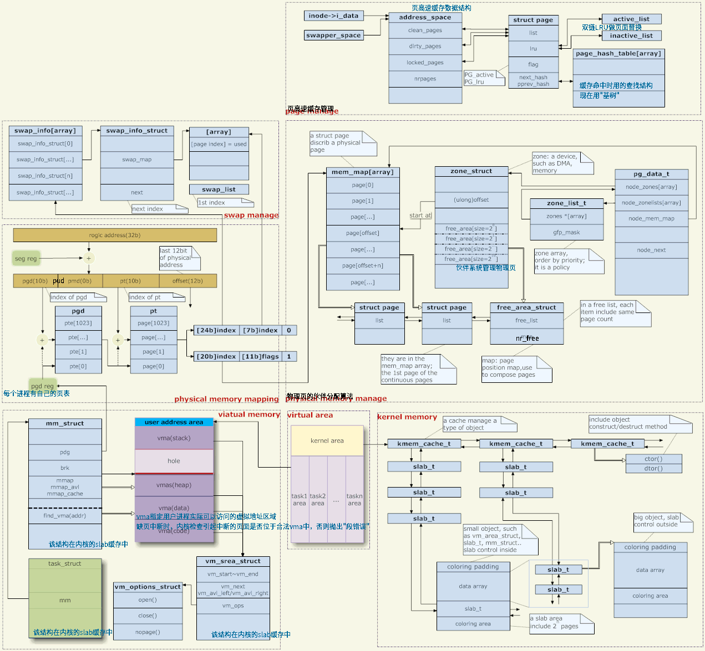

现代的CPU不仅采用了扩充的 *存储器段式管理机制*，而且还提供了可选的 *存储器分页管理机制*，所以操作系统不用亲自追踪所有的物理内存，可以利用微处理器提供的功能。

内存有关的内容包括：物理内存管理、虚拟内存管理、地址映射、内核空间管理、用户空间管理、内存回收

先放个大图，[来自][2]

针对上图，说几句，

## 地址映射(图：左中)

linux内核使用页式内存管理，应用程序给出的内存地址是虚拟地址，它需要经过若干级页表一级一级的变换，才变成真正的物理地址。

想一下，地址映射还是一件很恐怖的事情。当访问一个由虚拟地址表示的内存空间时，需要先经过若干次的内存访问，得到每一级页表中用于转换的页表项（页表是存放在内存里面的），才能完成映射。也就是说，要实现一次内存访问，实际上内存被访问了N+1次（N=页表级数），并且还需要做N次加法运算。

所以，地址映射必须要有硬件支持，mmu（内存管理单元）就是这个硬件。并且需要有cache来保存页表，这个cache就是TLB（Translation lookaside buffer）。

尽管如此，地址映射还是有着不小的开销。假设cache的访存速度是内存的10倍，命中率是40%，页表有三级，那么平均一次虚拟地址访问大概就消耗了两次物理内存访问的时间。

于是，一些嵌入式硬件上可能会放弃使用mmu，这样的硬件能够运行VxWorks（一个很高效的嵌入式实时操作系统）、linux（linux也有禁用mmu的编译选项）、等系统。

但是使用mmu的优势也是很大的，*最主要的是出于安全性考虑*。各个进程都是相互独立的虚拟地址空间，互不干扰。而放弃地址映射之后，所有程序将运行在同一个地址空间。于是，在没有mmu的机器上，一个进程越界访存，可能引起其他进程莫名其妙的错误，甚至导致内核崩溃。

在地址映射这个问题上，内核只提供页表，实际的转换是由硬件去完成的。那么内核如何生成这些页表呢？这就有两方面的内容，虚拟地址空间的管理和物理内存的管理。（实际上只有用户态的地址映射才需要管理，内核态的地址映射是写死的，直接对应。）

## 虚拟地址管理 (图：左下)

每个进程对应一个task_struct，它指向一个mm_struct，这就是该进程的内存管理器。（对于线程来说，每个线程也都有一个task结构，但是它们都指向同一个mm，所以地址空间是共享的。）

mm->pgd指向容纳页表的内存，每个进程有自已的mm，每个mm有自己的页表。于是，进程调度时，页表被切换（一般会有一个CPU寄存器来保存页表的地址，比如X86下的CR3，页表切换就是改变该寄存器的值）。所以，各个进程的地址空间互不影响（因为页表都不一样了，当然无法访问到别人的地址空间上。但是共享内存除外，这是故意让不同的页表能够访问到相同的物理地址上）。

用户程序对内存的操作（分配、回收、映射、等）都是对mm的操作，具体来说是对mm上的vma（虚拟内存空间）的操作。这些vma代表着进程空间的各个区域，比如堆、栈、代码区、数据区、各种映射区、等等。

用户程序对内存的操作并不会直接影响到页表，更不会直接影响到物理内存的分配。比如malloc成功，仅仅是改变了某个vma，页表不会变，物理内存的分配也不会变，这是一种延迟机制。

假设用户分配了内存，然后访问这块内存。由于页表里面并没有记录相关的映射，CPU产生一次缺页异常。内核捕捉异常，检查产生异常的地址是不是存在于一个合法的vma中。如果不是，则给进程一个"段错误"，让其崩溃；如果是，则分配一个物理页，并为之建立映射。

## 物理内存管理 (图：右中)

那么物理内存是如何分配的呢？

首先，linux支持NUMA（非均质存储结构），物理内存管理的第一个层次就是介质的管理。pg_data_t结构就描述了介质。一般而言，我们的内存管理介质只有内存，并且它是均匀的，所以可以简单地认为系统中只有一个pg_data_t对象。

每一种介质下面有若干个zone。一般是三个，DMA、NORMAL和HIGH。

DMA：因为有些硬件系统的DMA总线比系统总线窄，所以只有一部分地址空间能够用作DMA，这部分地址被管理在DMA区域（这属于是高级货了）；

HIGH：高端内存。在32位系统中，地址空间是4G，其中内核规定3~4G的范围是内核空间，0~3G是用户空间（每个用户进程都有这么大的虚拟空间）（图：中下）。内核的地址映射是写死的，就是指这3~4G的对应的页表是写死的，它映射到了物理地址的0~1G上。（实际上没有映射1G，只映射了896M。剩下的空间留下来映射大于1G的物理地址，而这一部分显然不是写死的）。所以，大于896M的物理地址是没有写死的页表来对应的，内核不能直接访问它们（必须要建立映射），称它们为高端内存（当然，如果机器内存不足896M，就不存在高端内存。如果是64位机器，也不存在高端内存，因为地址空间很大很大，属于内核的空间也不止1G了）；

NORMAL：不属于DMA或HIGH的内存就叫NORMAL。

在zone之上的zone_list代表了分配策略，即内存分配时的zone优先级。一种内存分配往往不是只能在一个zone里进行分配的，比如分配一个页给内核使用时，最优先是从NORMAL里面分配，不行的话就分配DMA里面的好了（HIGH就不行，因为还没建立映射），这就是一种分配策略。

每个内存介质维护了一个mem_map，为介质中的 *每一个物理页面建立了一个page结构与之对应*，然后使用伙伴算法管理这些page，具体参看[Linux 伙伴算法简介][3]

每个zone记录着它在mem_map上的起始位置。并且通过free_area串连着这个zone上空闲的page。物理内存的分配就是从这里来的，从 free_area上把page摘下，就算是分配了。（内核的内存分配与用户进程不同，用户使用内存会被内核监督，使用不当就"段错误"；而内核则无人监督，只能靠自觉，不是自己从free_area摘下的page就不要乱用。）

注意用户空间当然可以使用高端内存，而且是正常的使用，内核在分配那些不经常使用的内存时，都用高端内存空间(如果有)，所谓不经常使用是相对来说的，比如内核的一些数据结构就属于经常使用的，而用户的一些数据就属于不经常使用的。用户在启动一个应用程序时，是需要内存的，而每个应用程序都有3G的线性地址，给这些地址映射页表时就可以直接使用高端内存。

内核的高端线性地址是为了访问内核固定映射以外的内存资源。*在用户空间中没有高端内存这个概念*，用户空间的虚拟地址可以被内核映射到任意的物理地址上。

## 建立地址映射

内核需要物理内存时，很多情况是整页分配的，这在上面的mem_map中摘一个page下来就好了。比如前面说到的内核捕捉缺页异常，然后需要分配一个page以建立映射。

说到这里，会有一个疑问，内核在分配page、建立地址映射的过程中，使用的是虚拟地址还是物理地址呢？首先，内核代码所访问的地址都是虚拟地址，因为CPU指令接收的就是虚拟地址（地址映射对于CPU指令是透明的）。但是，建立地址映射时，内核在页表里面填写的内容却是物理地址，因为地址映射的目标就是要得到物理地址。

那么，内核怎么得到这个物理地址呢？其实，上面也提到了，mem_map中的page就是根据物理内存来建立的，每一个page就对应了一个物理页。

于是我们可以说，虚拟地址的映射是靠这里page结构来完成的，是它们给出了最终的物理地址。然而，page结构显然是通过虚拟地址来管理的（前面已经说过，CPU指令接收的就是虚拟地址）。那么，page结构实现了别人的虚拟地址映射，谁又来实现page结构自己的虚拟地址映射呢？没人能够实现。

这就引出了前面提到的一个问题，内核空间的页表项是写死的。在内核初始化时，内核的地址空间就已经把地址映射写死了。*page结构显然存在于内核空间，所以它的地址映射问题已经通过“写死”解决了*。

由于内核空间的页表项是写死的，又引出另一个问题，*NORMAL（或DMA）区域的内存可能被同时映射到内核空间和用户空间*。被映射到内核空间是显然的，因为这个映射已经写死了。而这些页面也可能被映射到用户空间的，在前面提到的缺页异常的场景里面就有这样的可能。映射到用户空间的页面应该优先从HIGH区域获取，因为这些内存被内核访问起来很不方便，拿给用户空间再合适不过了。但是HIGH区域可能会耗尽，或者可能因为设备上物理内存不足导致系统里面根本就没有HIGH区域，所以，将NORMAL区域映射给用户空间是必然存在的。

但是NORMAL区域的内存被同时映射到内核空间和用户空间并没有问题，因为如果某个页面正在被内核使用，对应的page应该已经从free_area被摘下，于是缺页异常处理代码中不会再将该页映射到用户空间。反过来也一样，被映射到用户空间的page自然已经从free_area被摘下，内核不会再去使用这个页面。

## 内核空间管理 (图：右下)

除了对内存整页的使用，有些时候，内核也需要像用户程序使用malloc一样，分配一块任意大小的空间。这个功能是由slab系统来实现的。

slab相当于为内核中常用的一些结构体对象建立了对象池，比如对应task结构的池、对应mm结构的池、对应vma结构的池等等。

而slab也维护有通用的对象池，比如"32字节大小"的对象池、"64字节大小"的对象池、等等。内核中常用的kmalloc函数（类似于用户态的malloc）就是在这些通用的对象池中实现分配的。

slab除了对象实际使用的内存空间外，还有其对应的控制结构。有两种组织方式，如果对象较大，则控制结构使用专门的页面来保存；如果对象较小，控制结构与对象空间使用相同的页面。

除了slab，linux 2.6还引入了mempool（内存池）。其意图是：某些对象我们不希望它会因为内存不足而分配失败，于是我们预先分配若干个，放在mempool中存起来。正常情况下，分配对象时是不会去动mempool里面的资源的，照常通过slab去分配。到系统内存紧缺，已经无法通过slab分配内存时，才会使用 mempool中的内容。

## 页面换入换出 (图：左上)

页面换入换出又是一个很复杂的系统。内存页面被换出到磁盘，与磁盘文件被映射到内存，是很相似的两个过程（内存页被换出到磁盘的动机，就是今后还要从磁盘将其载回内存）。所以swap复用了文件子系统的一些机制。

页面换入换出是一件很费CPU和IO的事情，但是由于内存昂贵这一历史原因，我们只好拿磁盘来扩展内存。

## 页高速缓存和页回写 (图：右上)

页高速缓存里的页，来自常规文件、块设备文件、内存映射文件的读写，即最近被访问过的文件的数据块。使用双链LRU算法替换最新的页。

Linux使用“回写”机制，来写缓存：程序执行写操作直接写到缓存中，后端存储不会立即刷新，而是将页高速缓存中被写入的页面标记为“脏”，并且加入到脏页链表中。flusher线程（每个设备一个）周期性将脏页链表中的页写回磁盘。

另外，图中的page_hash_table已经替换能为“基树”结构，用来检查页是否在高速缓存中。

内存不足、内存使用率达到某个阈值、或者定时器做内存回收时，会把buffer、cache里匿名映射内存换出到swap分区、文件映射内存回写到磁盘，以此来释放内存空间。

内存回收的具体内容参看：[Cgroup – Linux的内存回收和交换 – 穷佐罗的Linux书][4]

## 用户空间内存管理

malloc是libc的库函数，用户程序一般通过它（或类似函数）来分配内存空间。

libc对内存的分配有两种途径，*一是调整堆的大小，二是mmap一个新的虚拟内存区域*（堆也是一个vma）。

在内核中，*堆是一个一端固定、一端可伸缩的vma*（图：左中）。可伸缩的一端通过系统调用brk来调整。libc管理着堆的空间，用户调用malloc分配内存时，libc尽量从现有的堆中去分配。如果堆空间不够，则通过brk增大堆空间。
当用户将已分配的空间free时，libc可能会通过brk减小堆空间。但是堆空间增大容易减小却难，考虑这样一种情况，用户空间连续分配了10块内存，前9块已经free。这时，未free的第10块哪怕只有1字节大，libc也不能够去减小堆的大小。因为堆只有一端可伸缩，并且中间不能掏空。而第10块内存就死死地占据着堆可伸缩的那一端，堆的大小没法减小，相关资源也没法归还内核。

当用户malloc一块很大的内存时，libc会通过mmap系统调用映射一个新的vma。因为对于堆的大小调整和空间管理还是比较麻烦的，重新建一个vma会更方便（上面提到的free的问题也是原因之一）。

那么为什么不总是在malloc的时候去mmap一个新的vma呢？第一，对于小空间的分配与回收，被libc管理的堆空间已经能够满足需要，不必每次都去进行系统调用。并且vma是以page为单位的，最小就是分配一个页；第二，太多的vma会降低系统性能。缺页异常、vma的新建与销毁、堆空间的大小调整、等等情况下，都需要对vma进行操作，需要在当前进程的所有vma中找到需要被操作的那个（或那些）vma。vma数目太多，必然导致性能下降。（在进程的vma较少时，内核采用链表来管理vma；vma较多时，改用红黑树来管理。）

## 用户的栈

与堆一样，栈也是一个vma（图：左中），这个vma是一端固定、一端可伸（注意，不能缩）的。这个vma比较特殊，没有类似brk的系统调用让这个vma伸展，它是自动伸展的。

当用户访问的虚拟地址越过这个vma时，内核会在处理缺页异常的时候将自动将这个vma增大。内核会检查当时的栈寄存器（如：ESP），访问的虚拟地址不能超过ESP加n（n为CPU压栈指令一次性压栈的最大字节数）。也就是说，内核是以ESP为基准来检查访问是否越界。

但是，ESP的值是可以由用户态程序自由读写的，用户程序如果调整ESP，将栈划得很大很大怎么办呢？内核中有一套关于进程限制的配置，其中就有栈大小的配置，栈只能这么大，再大就出错。

对于一个进程来说，栈一般是可以被伸展得比较大（如：8MB）。然而对于线程呢？

首先线程的栈是怎么回事？前面说过，线程的mm是共享其父进程的。虽然栈是mm中的一个vma，但是线程不能与其父进程共用这个vma（两个运行实体显然不用共用一个栈）。于是，*在线程创建时，线程库通过mmap新建了一个vma，以此作为线程的栈*（大于一般为：2M）。

可见，线程的栈在某种意义上并不是真正栈，它是一个固定的区域，并且容量很有限。

参考：

* Understanding the linux kernel 3E
* Linux kernel development 3E
* Advanced programing in the UNIX environment 3E
* [深入理解计算机系统-之-内存寻址（一）--存储管理机制（虚拟地址，线性地址，物理地址） ](http://blog.csdn.net/gatieme/article/details/50646824)
* [《Linux内核设计与实现》读书笔记（十二）- 内存管理](http://www.cnblogs.com/wang_yb/archive/2013/05/23/3095907.html)
* [Linux 内存管理](http://blog.csdn.net/hguisu/article/details/6152921)
* [Linux 内存管理原理 cnblogs文章 很全面][2]
* [Cgroup – Linux内存资源管理 – 穷佐罗的Linux书 很深入浅出](http://liwei.life/2016/01/22/cgroup_memory/)
* [Cgroup – Linux的内存回收和交换 – 穷佐罗的Linux书 很深入浅出][4]
* [了解Linux 内存使用 csdn博客 也不错](http://blog.csdn.net/hguisu/article/details/7403855)

[2]: http://www.cnblogs.com/zhaoyl/p/3695517.html "Linux 内存管理原理"
[3]: http://www.cnblogs.com/cherishui/p/4246133.html "Linux 伙伴算法简介"
[4]: http://liwei.life/2016/06/27/linux%e7%9a%84%e5%86%85%e5%ad%98%e5%9b%9e%e6%94%b6%e5%92%8c%e4%ba%a4%e6%8d%a2/ "Cgroup – Linux的内存回收和交换 – 穷佐罗的Linux书"
