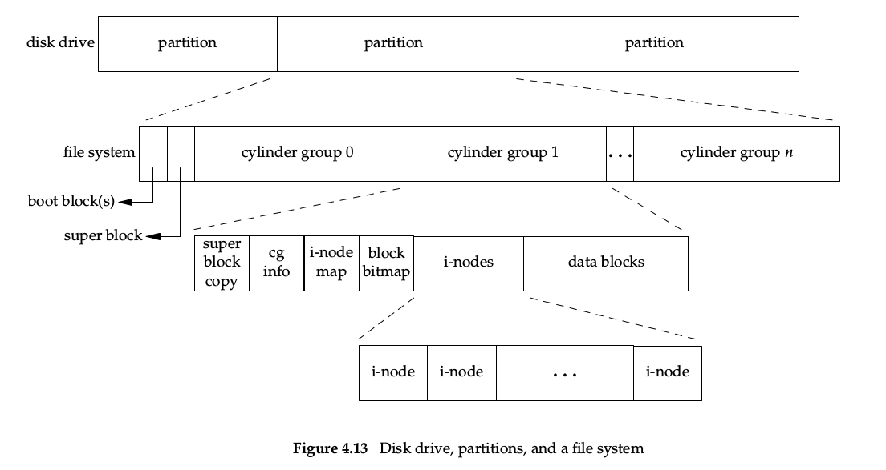
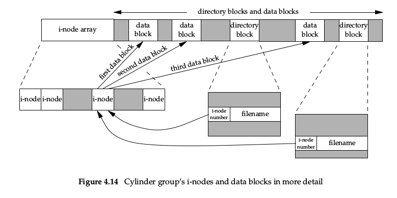
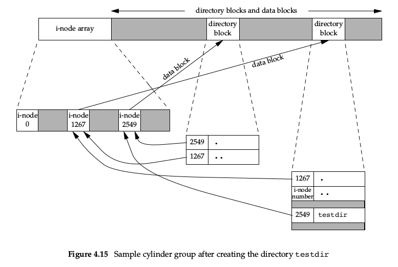
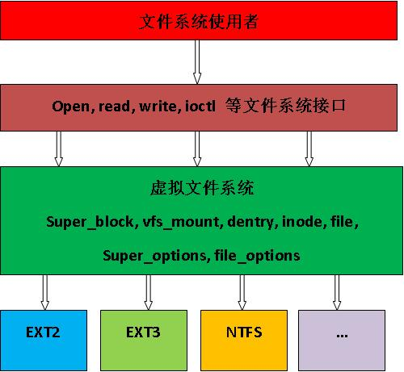
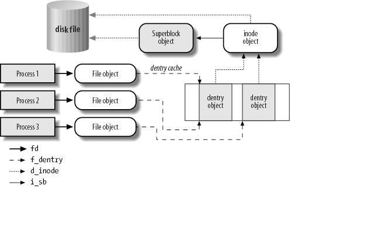
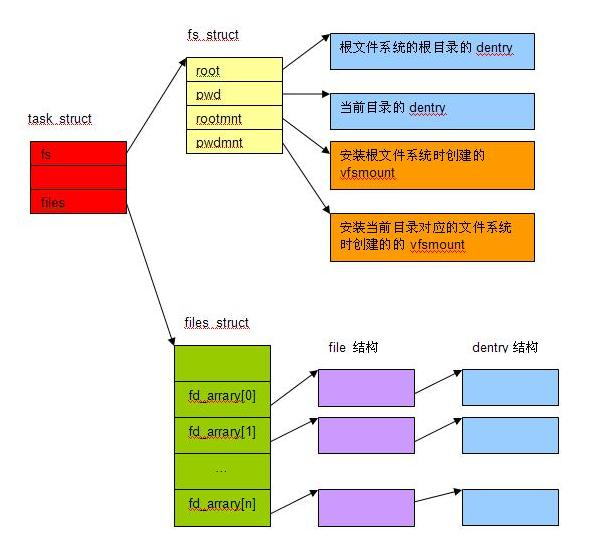

Linux 中允许众多不同的文件系统共存，如ext3, ext4, vfat等。通过使用同一套文件 I/O 系统调用即可对 Linux 中的任意文件进行操作而无需考虑其所在的具体文件系统格式；更进一步，对文件的操作可以跨文件系统而执行。而这一套文件 I/O 系统即虚拟文件系统VFS。

文件存储在硬盘上，硬盘的最小存储单位叫做“扇区”（sector），每个扇区512字节。

操作系统读取硬盘的时候，不会一个个扇区的读取，这样效率太低，而是一次性读取多个扇区，即一个“块”（block）。这种由多个扇区组成的“块”，是文件存取的最小单位。“块”的大小，最常见的是4KB。

文件数据储存在“块”中，此外我们还需要一个地方存储文件的元信息，例如文件的创建者、创建日期、修改日期、文件大小等。这种存储文件元信息的区域就叫做inode，中文译名“索引节点”。

大部分的文件系统，如Ext、Fat、Ntfs等，都会在磁盘格式化的时候创建inode区，存放文件的inode信息。

Linux的VFS子系统，会对磁盘中的inode信息做一个封装，形成VFS中定义的inode结构体。

每一个文件都有对应的inode，里面包含了与该文件有关的一些信息。另外系统为了加速查找引入了目录项dentry结构，为了实现进程中对文件的操作引入了文件对象file。

## 磁盘文件存储

APUE P91，4.14节的图很清楚的说明了磁盘、分区、文件系统、文件节点、数据块之间的关系，看图



1. i节点中都有一个链接计数，其值是指向该i节点的目录项数。当链接数为0时，才会释放数据块
2. i节点包含文件相关的所有内容。文件类型、文件访问权限位、文件长度和指向文件数据块的指针等。
3. 目录项只存放两项重要数据：i节点编号、文件名
4. 目录项中的 i节点编号只能指向同一文件系统中的i节点。所以ln(1)命令不能跨越文件系统
5. 符号链接文件的实际内容（在数据块中）包含了该符号链接所指向的文件的名字。该文件名字可以跨文件系统
6. 在不改变文件系统的情况下对一个文件进行重命名，不会移动文件的实际内容，仅创建新的指向现在i节点的目录项，删除旧的目录项。

当我们使用命令 `mkdir testdir` 创建一个目录后，磁盘结构如下图：


1. i-node 2549指向一个目录块，即testdir目录的实际数据块
2. i-node 2549的引用计数位2，任何叶子目录的引用计数都是2.一个来自父目录的引用，一个来自自身目录的 .文件夹
3. i-node 2549的父目录为1267，同样指向一个目录数据块，里边包含指向自身的.，指向父目录的..，和包含的目录项2549:testdir

使用ls查看就是下面这样：

```
$ mkdir testdir

;; 查看inode 1267的内容
$ ls -al
总用量 12
drwxrwxr-x  3 lan_cyl lan_cyl 4096 8月  23 12:36 .
drwxrwxr-x 12 lan_cyl lan_cyl 4096 8月  23 12:36 ..
drwxrwxr-x  2 lan_cyl lan_cyl 4096 8月  23 12:36 testdir

;; 查看testdir目录的内容
$ ls testdir -al
总用量 8
drwxrwxr-x 2 lan_cyl lan_cyl 4096 8月  23 12:36 .
drwxrwxr-x 3 lan_cyl lan_cyl 4096 8月  23 12:36 ..

```

## Linux 虚拟文件系统

VFS是一套代码框架（framework），它处于文件系统的使用者与具体的文件系统之间，将两者隔离开来。这种引入一个抽象层次的设计思想，即“上层不依赖于具体实现，而依赖于接口；下层也不用关心调用，只用实现接口”，就算面向对象里的“面向接口编程”吧。

VFS的框架图如下，图片来自[Linux内核文件系统学习：虚拟文件系统(多图）][1]


VFS核心数据结构：

#### 超级块 super_block

存放系统中已安装文件系统的有关信息，针对文件系统级别的概念。

它一般存在于磁盘的特定扇区中，但是对于那些基于内存的文件系统（比如proc, sysfs），超级块是在使用时创建在内存中的。

超级块的定义在：<linux/fs.h>

```
/*
 * 超级块结构中定义的一些重要的属性
 */
struct super_block {
    struct list_head      s_list;     /* 指向所有超级块的链表 */
    const struct super_operations  *s_op;   /* 超级块方法 */
    struct dentry         *s_root;    /* 目录挂载点 */
    struct mutex          s_lock;     /* 超级块信号量 */
    int                   s_count;    /* 超级块引用计数 */

    struct list_head      s_inodes;   /* inode链表 */
    struct mtd_info       *s_mtd;     /* 存储磁盘信息 */
    fmode_t               s_mode;      /* 安装权限 */
};

```

#### 索引节点 inode

存放有关具体文件的一般信息。（这里的文件包括普通文件、目录、特殊设备文件等）

索引节点和超级块一样是实际存储在磁盘上的，当被进程访问到时才会在内存中创建

索引节点定义在：<linux/fs.h>

```
/*
 * 索引节点结构中定义的一些重要的属性
 */
struct inode {
    struct hlist_node i_hash;    /* 散列表，用于快速查找inode */
    struct list_head  i_list;    /* 索引节点链表 */
    struct list_head  i_sb_list; /* 超级块链表超级块  */
    struct list_head  i_dentry;  /* 目录项链表 */
    unsigned long     i_ino;     /* 节点号 */
    atomic_t          i_count;   /* 引用计数 */
    unsigned int      i_nlink;   /* 硬链接数 */

    uid_t             i_uid;     /* 使用者id */
    gid_t              i_gid;     /* 使用组id */
    struct timespec   i_atime;   /* 最后访问时间 */
    struct timespec   i_mtime;   /* 最后修改时间 */
    struct timespec   i_ctime;    /* 最后改变时间 */

    const struct inode_operations  *i_op;       /* 索引节点操作函数 */
    const struct file_operations   *i_fop;      /* 缺省的索引节点操作 */
    struct super_block            *i_sb;        /* 相关的超级块 */
    struct address_space          *i_mapping;   /* 相关的地址映射 */
    struct address_space          i_data;       /* 设备地址映射 */
    unsigned int                  i_flags;      /* 文件系统标志 */
    void                          *i_private;   /* fs 私有指针 */
};
```

#### 目录项 dentry

存放目录项与对应文件进行链接的信息，是磁盘目录文件中包含的一组数据。

由于索引节点对象的属性非常多，在查找、比较文件时效率不高，所以引入了目录项的概念。

目录层层嵌套形成文件路径，而路径中的每个部分都是一个目录项，比如路径：/mnt/cdrom/foo/bar/test.txt 其中包含6个目录项，/ mnt cdrom foo bar test.txt

目录项的目的就是提高文件查找速率，所以根据局部性原理，把访问过的目录项缓存在slab中

目录项的定义在：<linux/dcache.h>

```
/*
 * 目录项对象结构的主要字段
 */
struct dentry {
    atomic_t      d_count;         /* 使用计数 */
    unsigned int  d_flags;         /* 目录项标识 */
    spinlock_t    d_lock;          /* 单目录项锁 */
    struct inode  *d_inode;        /* 相关联的索引节点 */
    struct hlist_node  d_hash;     /* 散列表 */
    struct dentry      *d_parent;  /* 父目录的目录项对象 */
    struct qstr        d_name;     /* 目录项名称 */
    struct list_head   d_lru;      /* 未使用的链表 */

    struct list_head   d_subdirs;  /* 子目录链表 */
    struct list_head   d_alias;    /* 索引节点别名链表 */
    unsigned long       d_time;    /* 重置时间 */
    const struct dentry_operations *d_op; /* 目录项操作相关函数 */

    unsigned char      d_iname[DNAME_INLINE_LEN_MIN];   /* 短文件名 */
};
```

#### 文件对象

存放打开文件与进程之间进行交互的有关信息

文件对象反过来指向一个目录项对象，目录项对象再指向一个索引节点，索引节点指向具体的数据块

其实只有目录项对象才表示一个已打开的实际文件

文件对象的定义在: <linux/fs.h>

```
/*
 * 文件对象结构中定义的一些重要的属性
 */
struct file {
    union {
        struct llist_node  fu_llist;      /* 文件对象链表 */
        struct rcu_head    fu_rcuhead;    /* 释放之后的RCU链表 */
    } f_u;
    struct path            f_path;        /* 包含的目录项 */
    struct inode           *f_inode;      /* 缓存值 */
    const struct file_operations  *f_op;  /* 文件操作函数 */

    atomic_long_t          f_count;       /* 文件对象引用计数 */
};

```

### 四个主要对象之间的关系



## 进程与文件

进程与文件关系图：


进程描述符task_struct里包含一个files_struct结构，用于管理该进程的文件描述符表，所有打开的文件的file结构指针都保存在这个数组里，而程序里用到的文件描述符就是这个数组的下标

files_struct管理文件描述符表，定义在：<linux/fdtable.h>

```
/*
 * 打开文件表结构
 */
struct files_struct {
  atomic_t     count;           /* 使用计数 */
  bool         resize_in_progress;
  wait_queue_head_t resize_wait;

  struct fdtable __rcu  *fdt;   /* 使用计数 */
  struct fdtable        fdtab;  /* 使用计数 */
  spinlock_t file_lock ____cacheline_aligned_in_smp;
  int next_fd;
  unsigned long      close_on_exec_init[1];     /* 执行exec()时关闭的文件描述符链表 */
  unsigned long      open_fds_init[1];          /* 打开的文件描述符链表 */
  unsigned long      full_fds_bits_init[1];      
  struct file __rcu  *fd_array[NR_OPEN_DEFAULT];/* 缺省的打开文件数组 */
};
```

task_struct 中与文件系统相关的还有另外一个成员 fs，它指向一个 fs_struct，定义在：<linux/fs_struct.h>

```
struct fs_struct {
  int users;              /* 用户数目 */
  spinlock_t lock;
  seqcount_t seq;
  int umask;              
  int in_exec;            /* 当前正在执行的文件 */
  struct path root, pwd;  /* 根目录路径和当前工作目录路径 */
};
```

参考：

- [Linux内核文件系统学习：虚拟文件系统(多图)][1]
- [Linux内核源代码情景分析-第五章 文件系统][2]
- [Linux的inode的理解][3]
- [理解inode --阮一峰blog][4]
- [史上最经典的Linux内核学习方法论][5]

[1]: http://rstevens.iteye.com/blog/849413 "Linux内核文件系统学习：虚拟文件系统(多图)"
[2]: http://blog.sina.com.cn/s/blog_6b94d5680101vfqv.html "Linux内核源代码情景分析-第五章 文件系统"
[3]: http://www.cnblogs.com/itech/archive/2012/05/15/2502284.html "Linux的inode的理解"
[4]: http://www.ruanyifeng.com/blog/2011/12/inode.html "理解inode --阮一峰blog"
[5]: http://blog.chinaunix.net/uid-26258259-id-3783679.html "史上最经典的Linux内核学习方法论"
