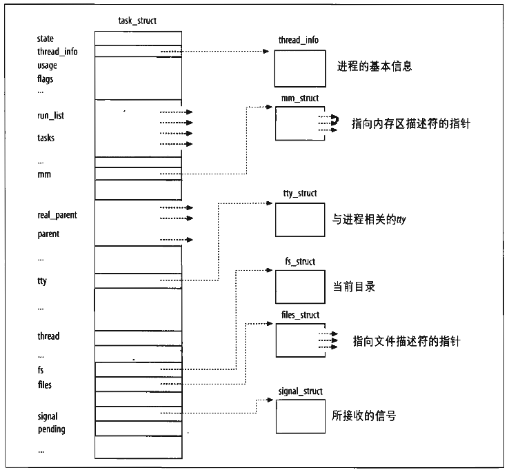

[1 进程表示](#1)  
  [1.1 进程描述符处理](#1.1)  
  [1.2 进程链表](#1.2)  
  [1.3 进程关系](#1.3)  
  [1.4 进程状态](#1.4)

[2 进程切换](#2)  
 [2.1 硬件上下文切换](#2.1)  
 [2.2 执行进程切换](#2.2)  

[3 进程地址空间](#3)

[4 进程创建](#4)

[5 进程销毁](#5)

[6 进程调度算法](#6)

[7 进程间通信](#7)

> 触发任何一个事件时，系统都会将他定义为一个程序，并且给予这个程序一个ID，称为PID，同时依据启发这个程序的使用者与相关属性关系，给予这个PID一组有效的权限设定

## 1 进程表示

为了管理进程，内核必须对每个进程所做的事情进行清楚的描述。这正是进程描述符(process descriptor)的作用，进程描述符都是task_struct类型结构，它的字段包含了与一个进程相关的所有信息。

下图示意性的描述了Linux的进程描述符：


进程与进程描述符之间有非常严格的一一对应关系，这使得用32位进程描述符地址标识进程成为一种方便的方式。内核对进程的大部分引用是通过进程描述符指针进行的。

另外Linux还允许用户使用一个叫做进程标识符process ID的数来标识进程，PID的分配是+1循环的方式，类似port的分配。Linux使用内核初始化时动态创建的4个hash表快速查找pid、tgid、pgid、sid

### 1.1 进程描述符处理

进程是动态实体，其生命周期范围从几毫秒到几个月。因此内核必须能够同时处理很多进程，并把进程描述符存放在动态内存中，而不是放在永久分配的内核区。

2.6内核之前，进程描述符就是放到每个进程的内核栈的末尾，即在永久分配的内核区。之后使用新的结构thread_info放置在内核栈的末尾，该结构的task指针指向slab分配器动态分配的进程描述符task_struct，上图可以看到task_strct也有反向的指针

内核态的进程访问处于内核数据段的栈，所以每个用户进程也会默认分配两页的内核栈。thread_info结构和进程内核栈存放在两个连续的页框中，如下图：


屏蔽掉内核栈指针esp的低13位，就可以得到thread_info结构的基地址，然后task的内容即为进程描述符的地址了。快捷获得当前进程的描述符的算法，早期使用一个current全局静态变量来保存

### 1.2 进程链表

内核实现了list_head数据结构，里边仅包含pre、next指针指向上下一个list_head结构。任何想要实现双向链表的数据结构都可加上list_head字段，以此来实现双向链表，而且内核还针对list_head实现了操作方法。

#### 1.2.1 运行队列链表

据说（待查证？？？）TASK_RUNNING状态的进程，在2.6内核之后，会被保存在140个不同优先级队里里边，以此来加快调度程序的速度。但是根据CFS算法来看，明明是对优先级为权重建的红黑树，每次取最左边，即优先级值最小的那个线程。这个留到进程调度部分再深究

#### 1.2.2 等待队列链表

每个等待事件都有自己的等待链表，例如等待磁盘操作的终止、资源释放、时间经过固定的间隔。这三种等待事件分别代表了中断处理、进程同步和定时操作。

每个等待队列都有个等待队列头(wait_queue_head_t)，里边包含一个自旋锁和一个等待队列链表。等待队列的元素都封装在wait_queue_t中，其中包含等待事件是否互斥的标识flags字段、对应的进程描述符task指针、前后等待队列元素链表task_list、还有一个指向唤醒方式的字段func。

### 1.3 进程关系

父、子、兄弟关系，分别对应字段real_parent\parent、children、sibling

另外还有登陆会话、进组组、线程组的概念

### 1.4 进程状态

r TASK_RUNNING; s TASK_INTERRUPTIBLE; d TASK_UNINTERRUPTIBLE; t TASK_STOPPED/TASK_TRACED; z EXIT_ZOMBIE/TASK_DEAD

## 2 进程切换

> 为了控制进程的执行，内核必须有能力挂起正在CPU运行的进程，并恢复以前挂起的某个进程的执行。这种行为被称为进程切换（process switch）。

### 2.1 硬件上下文切换

进程恢复前必须装入寄存器的一组数据称为硬件上下文(hardware context)，硬件上下文时进程上下文的一个子集，进程上下文包含程序执行所需的所有信息

Linux中，进程硬件上下文的一部分存放在TSS段，而剩余部分存放在内核态堆栈中

进程切换只发生在内核态。在执行进程切换之前，用户态进程使用的所有寄存器内容都已保存在内核态堆栈上。

Linux位每个CPU使用TSS，所以TSS信息保存在进程描述符里的thread字段里，涉及到部分寄存器

### 2.2 执行进程切换

进程切换一般只发生在schedule()函数处

本质上，进程切换包含如下两步：
 1. 切换页全局目录
 2. 切换内核态堆栈和硬件上下文

## 3 进程地址空间

一个进程所使用的地址与另一个进程所使用的地址之间没有什么关系。内核通过所谓的线性区vma来表示线性地址空间，线性区是由起始线性地址、长度和一些访问权限来描述的。

进程获得新线性区的一些典型情况：
 1. 当用户在控制台输入一条命令时，shell进程创建一个新的进程去执行这个命令。结果是，一个全新的地址空间（也就是一组线性区）被分配给了新地址
 2. 正在运行的进程有可能决定装入一个完全不同的程序（exec函数）。此时，进程描述符不变，装入前所使用的线性区被释放，并分配一组新的线性区给这个进程
 3. 正在运行的进程可能对一个文件（或一部分）执行“内存映射”。此时，内核给这个进程分配一个新的线性区来映射这个文件
 4. 进程持续向它的用户态堆栈增加数据，直到映射这个堆栈的线性区用完为止。此时，内核会扩展这个线性区的大小
 5. 进程创建一个IPC共享线性区来与其他合作进程共享数据。此时，内核给这个进程分配一个新的线性区以实现这个方案
 6. 进程通过malloc()这样的函数扩展自己的动态区（堆）。此时，内核扩展这个堆的大小

与进程地址空间有关的全部信息都包含在一个叫做内存描述符的数据结构里，这个结构的类型为mm_struct，进程描述符的mm字段指向这个结构

缺页中断时会检查缺页地址是否属于该进程的地址空间、访问类型与线性区的访问权限是否匹配，否则会发送SIGSEGV信号

线程栈的空间开辟在所属进程的堆区，线程与其所属的进程共享进程的用户空间，所以线程栈之间可以互访。线程栈的起始地址和大小存放在pthread_attr_t 中，栈的大小并不是用来判断栈是否越界，而是用来初始化避免栈溢出的缓冲区的大小（或者说安全间隙的大小）[Linux 进程栈和线程栈的区别](http://blog.csdn.net/daniel_ice/article/details/8146003)

## 4 进程创建

传统Unix操作系统以统一的方式对待所有的进程：子进程复制父进程所拥有的资源。但是创建速度较慢、而且拷贝来的地址空间一般都没用，故引入三种不同的机制：
 1. Copy on Write：创建进程时，子进程拥有父进程相同的物理页，当一个进程试图改写某个物理页时，内核复制该页并分配给改写进程进行改写操作。
 2. Lightweight process：共享很多内核数据结构，例如页表、打开的文件表、信号处理器
 3. vfork()：共享内存地址空间，相当于创建一个线程

fork()系统调用是用clone()实现的，flags参数值设定SIGCHILD信号，所有的CLONE_flags都被清空，child_stack参数等于当前父进程的栈指针。这就是 写时拷贝 技术，父子进程暂时共用用户栈，

vfork()系统调用也是用clone()实现的，flags参数被设为SIGCHILD|CLONE_VM|CLONE_VFORK，child_stack参数也等于父进程的指针。vfork函数用于创建一个新进程，而新进程的目的是exec一个新程序。父进程会等待子进程执行

C库的clone()函数，它会为新的LWP创建一个栈，然后隐式的调用clone()系统调用。clone()系统调用是没有fn和arg参数的，C库的封装函数会把fn指针保存在 子进程的封装函数的返回地址 对应的栈位置里，参数arg保存在子进程的栈中fn的后面。当子进程从clone()封装函数返回的时候，CPU从栈里获取返回地址，然后执行fn(arg)

clone(), fork(), vfork()系统调用最后都是用的do_fork()函数，过程如下：
 1. 查找pidmap_array位图，为子进程分配新的PID
 2. 检查父进程的ptrace字段。如果不为0，则有另外一个进程跟踪父进程，do_fork()检查debugger是否自己想跟踪子进程，如果是则设置CLCLONE_PTRACE标志
 3. 调用copy_process()复制进程描述符
 4. 如果设置了CLONE_STOPPED标志，或者必须跟踪子进程，那么子进程的状态被设置位TASK_STOPPED，并为子进程增加挂起的SIGSTOP信号。
 5. 如果没用设置CLONE_STOPPED标示，则调用wake_up_new_task()函数以执行下述操作：
  1. 调整父进程和子进程的调度参数
  2. 如果父子进程在同一CPU上运行，且不能共享页表（CLONE_VM标志被清0），那么子进程插入到父进程运行队列，且在父进程的前面。即子进程先运行
  3. 否则，如果在不同CPU运行或者共享页表，则插到尾部
 6. 如果父进程被跟踪，则把子进程的PID存入current.ptrace_message字段并调用ptrace_notify，通知debugger进程创建了一个子进程
 7. 如果设置了CLONE_VFORK标志，则把父进程插入等待队列，直到子进程释放自己的内存空间
 8. 结束并返回子进程的PID

#### 4.1 fork和vfork的区别

fork（）与vfock（）都是创建一个进程，那他们有什么区别呢？总结有以下三点区别：
 1. fork()子进程拷贝父进程的数据段，代码段； vfork()子进程与父进程共享数据段
 2. fork()父子进程的执行次序不确定； vfork 保证子进程先运行，在调用exec 或exit 之前与父进程数据是共享的, 之后父进程才可能被调度运行
 3. vfork()保证子进程先运行，在她调用exec 或exit 之后父进程才可能被调度运行。如果在调用这两个函数之前子进程依赖于父进程的进一步动作，则会导致死锁。

## 5 进程终止

一个进程的结束，是由调用exit()系统调用来完成的，exit()将在内核中调起do_exit()函数，流程如下：
 1. 将current->flag的PF_EXITING置上，以表示程序正在被删除；
 2. 如果需要，通过函数del_timer_sync()从动态定时器队列中删除该进程描述符
 3. 调用exit_mm(), exit_sem(), \__exit_files(), \___exit_fs(), exit_namespace(), exit_thread()函数从进程描述符中分离与分页、信号量、文件系统、打开文件描述符、命名空间以及I/O权限位图相关的数据结构，引用计数为0时删除
 4. current->exit_code被设置，用于之后parent取得该值
 5. 调用 exit_notify()来发送一个信号给parent，同时将current->state置为TASK_ZOMBIE
 6. 调用 schedule()将当前进程换出

#### 5.1 进程删除

Unix允许进程查询内核以获得其父进程的PID，或者任何子进程的执行状态。

所以不允许内核在进程一终止后就丢弃包含在进程描述符字段中的数据。只有父进程发出了与被终止进程相关的wait()类系统调用之后，才允许这样做。这就是引入僵死状态的原因：尽管从技术上进程已死，但必须保存它的描述符，直到父进程得到通知

如果父进程在子进程结束之前结束，init进程会称为子进程的养父进程，间隔调用wait()类系统调用来检查子进程状态，删除僵死子进程。

进程删除的步骤如下：
 1. 递减终止进程拥有者的进程个数。保存在user_struct结构中，指示当前用户拥有的进程个数
 2. 如果进程正在被跟踪，则从调试程序的链表中删除，
 3. 删除所有的未决信号，并释放进程的signal_struct描述符
 4. 删除信号处理函数
 5. 删除所有的定时器
 6. 从PID哈希表里删除对应进程描述符，从进程链表里删除进程描述符链接
 7. 如果该进程不是领头进程，且领头进程处于僵死状态，该进程时线程组的最后一个成员，则向领头进程的父进程发送进程死亡通知信号
 8. 调整父进程的时间片
 9. 递减进程描述符使用计数器

## 6 进程调度算法

进程调度主要关心什么时候、选择哪个进程进行调度

进程启动的时候都有一个nice值，或者从父进程继承而来，这个表示进程的静态优先级。取值为 [-20, 19]

还有个priority字段，表示进程的动态优先级。取值为[0, 139]。其中0-99表示实时进程的优先级，100-139表示普通进程的优先级，值越小优先级越高。这里隐含了一个信息，就是说当前的Linux是一种已经支持实时进程的操作系统。

每个进程都会关联一个调度方法，对于实时进程可以用的调度策略是：SCHED_FIFO（先进先出）、SCHED_RR（时间片轮转），而对于非实时进程则是：SCHED_BATCH、SCHED_OTHER（cfs调度算法）、SCHED_IDLE。

#### 6.1 进程调度的时机

 1. 当前进程的状态切换时。
 2. 当前进程主动放弃CPU时。
 3. 当前进程的vruntime时间大于每个进程的理想占用时间时（delta_exec > ideal_runtime）。
 4. 当进程从中断、异常或系统调用返回时

#### 6.2 O1调度算法

O1调度算法是在Linux 2.6开始引入的，到Linux 2.6.23之后内核将调度算法替换成了CFS。这个调度器的名字之所以叫做O1，主要是因为其算法的时间复杂度是O(1)。

O1调度器仍然是根据经典的时间片分配的思路来进行整体设计的。优先级高的进程使用大的时间片。另外相同nice值的进程也会根据进程的运行情况，判断进程是CPU密集型还是I/O密集型任务，来把优先级+-5，以此来提高I/O密集型进程的优先级

O1调度器在处理流程上大概是这样进行调度的：

 1. 首先，进程产生（fork）的时候会给一个进程分配一个时间片长度。这个新进程的时间片一般是父进程的一半，而父进程也会因此减少它的时间片长度为原来的一半。就是说，如果一个进程产生了子进程，那么它们将会平分当前时间片长度。比如，如果父进程时间片还剩100ms，那么一个fork产生一个子进程之后，子进程的时间片是50ms，父进程剩余的时间片是也是50ms。这样设计的目的是，为了防止进程通过fork的方式让自己所处理的任务一直有时间片。不过这样做也会带来少许的不公平，因为先产生的子进程获得的时间片将会比后产生的长，第一个子进程分到父进程的一半，那么第二个子进程就只能分到1/4。对于一个长期工作的进程组来说，这种影响可以忽略，因为第一轮时间片在耗尽后，系统会在给它们分配长度相当的时间片。
 2. 针对所有R状态进程，O1算法使用两个队列组织进程，其中一个叫做活动队列，另一个叫做过期队列。活动队列中放的都是时间片未被耗尽的进程，而过期队列中放时间片被耗尽的进程。
 3. 如1所述，新产生的进程都会先获得一个时间片，进入活动队列等待调度到CPU执行。而内核会在每个tick间隔期间对正在CPU上执行的进程进行检查。一般的tick间隔时间就是cpu时钟中断间隔，每秒钟会有1000个，即频率为1000HZ。每个tick间隔周期主要检查两个内容：1、当前正在占用CPU的进程是不是时间片已经耗尽了？2、是不是有更高优先级的进程在活动队列中等待调度？如果任何一种情况成立，就把则当前进程的执行状态终止，放到等待队列中，换当前在等待队列中优先级最高的那个进程执行。

#### 6.3 CFS调度算法

调度器只需要对所有进程维护一个累积占用CPU时间数，就可以衡量出每个进程目前占用的CPU时间总量是不是过大或者过小，这个数字记录在每个进程的vruntime中。所有待执行进程都以vruntime为key放到一个由红黑树组成的队列中，每次被调度执行的进程，都是这个红黑树的最左子树上的那个进程，即vruntime时间最少的进程，这样就保证了所有进程的相对公平。


优先级规则：

CFS的优先级体现在时间消耗的快慢（vruntime的增长）上。比如，优先级为19的进程，实际占用cpu为1秒，那么在vruntime中就记录1s。但是如果是-20优先级的进程，那么它很可能实际占CPU用10s，在vruntime中才会纪录1s。

vruntime的计算：

```
delta vruntime = delta Time * prio_to_weight[nice] / load
```

`delta vruntime` 表示vruntime的增加量，`delta Time` 为CPU占用时间，`prio_to_weight`为内核保存的权重数组 优先级越高该值越下 大约在10%的梯度下降，`load` 为当前进程数

差不多都讲清楚了吧，另外还有写细节部分，比如创建新进程时，由于vruntime随着进程运行不断增加，所以vruntime的初始值不能时静态的，也要随着系统运行不断调整；vruntime也不能太小了，不然某个进程先暂停半天，然后运行就会长时间霸占CPU了，最少取调度周期的一半

具体可以看看这个，[Linux的进程优先级 穷佐罗的Linux书](http://liwei.life/2016/04/07/linux%e7%9a%84%e8%bf%9b%e7%a8%8b%e4%bc%98%e5%85%88%e7%ba%a7/)

## 7 进程间通信

管道、fifo、信号量数组、消息队列、共享内存、signal、文件锁

具体见下篇文章

参考：

- 深入理解Linux内核 第三版
- [Linux 进程栈和线程栈的区别](http://blog.csdn.net/daniel_ice/article/details/8146003)
- [Linux的进程优先级 穷佐罗的Linux书](http://liwei.life/2016/04/07/linux%e7%9a%84%e8%bf%9b%e7%a8%8b%e4%bc%98%e5%85%88%e7%ba%a7/)
